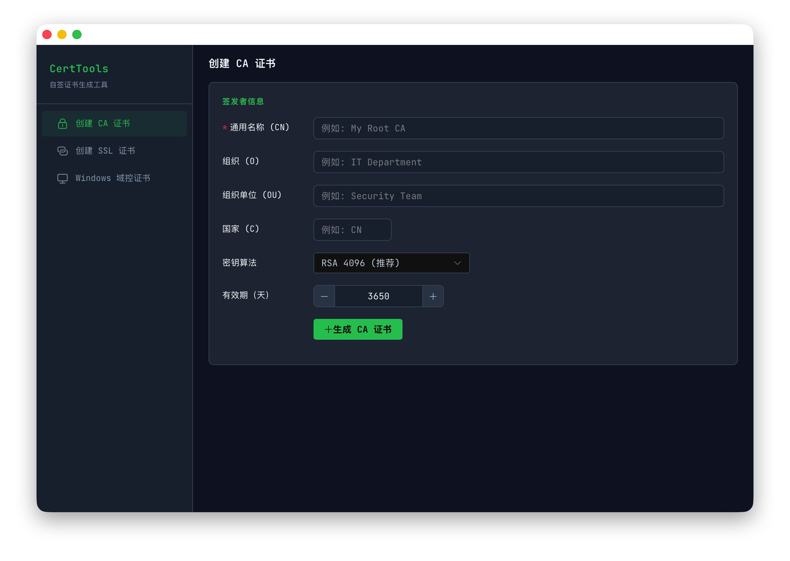
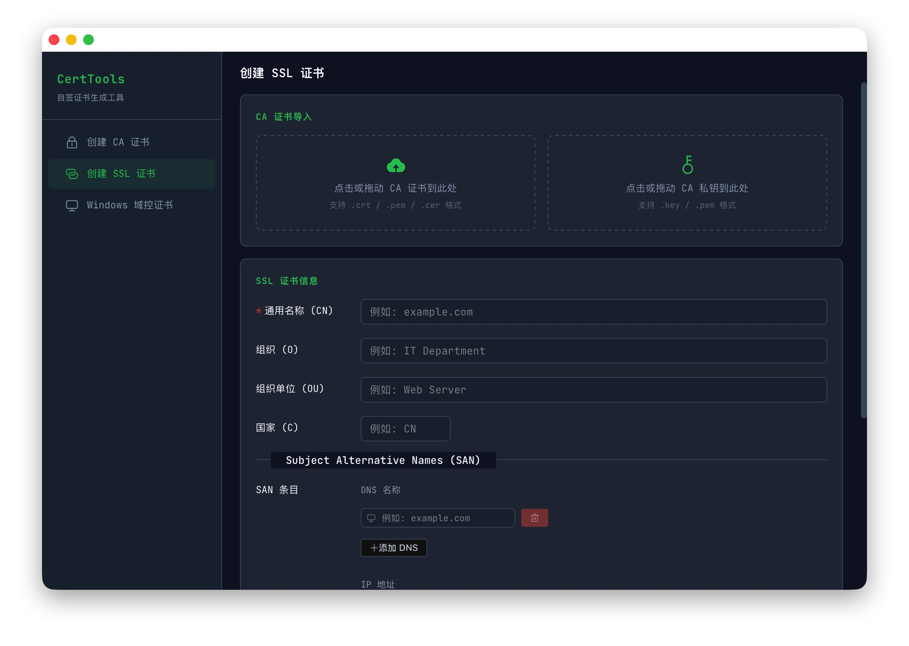
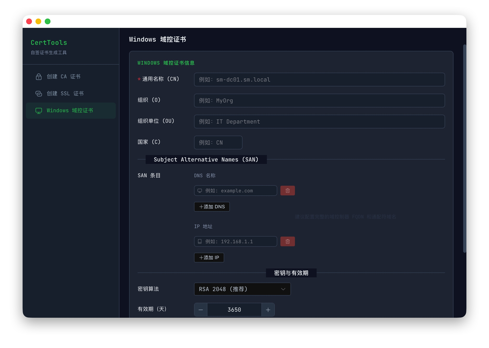

# CertTools - 自签证书生成工具

CertTools 是一款基于 Tauri 2.0 的跨平台自签证书生成桌面工具，提供 **创建 CA 证书**、**创建 SSL 证书** 和 **Windows 域控证书生成** 三大功能模块，帮助开发者和运维人员快速生成内部使用的 TLS 证书。


## 功能特性

- **创建 CA 证书**
  - 支持 4 种密钥算法：RSA 2048 / RSA 4096 / ECDSA P-256 / ECDSA P-384
  - 可配置主题信息（CN / O / OU / C）和有效期
  - 自动附加 CA 标准扩展（basicConstraints: CA:TRUE, keyUsage: keyCertSign/cRLSign）

- **创建 SSL 证书**
  - 导入 CA 证书 + 私钥（支持点击选择或**拖拽导入**）
  - 支持 Subject Alternative Names (SAN) 编辑：DNS 名称和 IP 地址动态增删
  - 自动附加 serverAuth 扩展和 authorityKeyIdentifier
  - 一键保存证书 / 私钥 / 完整链（cert + CA 拼接）

- **Windows 域控证书生成** ⭐️
  - 自动生成 CA 私钥、自签名根证书
  - 生成服务器私钥和 CSR，使用 CA 签发带 SAN 扩展的服务器证书
  - 打包为 PFX 文件（包含私钥、服务器证书和 CA 证书），支持自定义密码保护
  - 提供独立的 CA.crt，用于 LDAPS 信任链配置

- **证书信息展示**
  - 主题、签发者、序列号、有效期
  - SHA-256 / SHA-1 指纹
  - SAN 列表

- **界面体验**
  - 深色 OLED 主题，开发者工具视觉风格
  - 启动骨架屏（shimmer 动画），避免白屏等待
  - 拖拽高亮反馈

## 技术栈

| 层 | 技术 |
|----|------|
| 桌面框架 | Tauri 2.0 |
| 后端 | Rust (2021 edition) + openssl crate |
| 前端 | Vue 3.5 + TypeScript + Vite 6 |
| UI 组件库 | Element Plus（深色主题） |
| 图标 | @element-plus/icons-vue |
| 安装包 | NSIS（Windows）/ DMG（macOS） |

## 目录结构

```
CertTools/
├── src/                        # Vue 前端
│   ├── App.vue                 # 主布局（侧栏导航）
│   ├── main.ts                 # 入口 + Element Plus 深色主题
│   ├── style.css               # 设计系统 CSS 变量
│   ├── router/                 # 路由配置
│   ├── views/
│   │   ├── CreateCA.vue        # 创建 CA 证书
│   │   ├── CreateSSL.vue       # 创建 SSL 证书
│   │   └── CreateDomainCert.vue # Windows 域控证书生成
│   ├── components/
│   │   ├── CertInfoDisplay.vue # 证书信息面板
│   │   └── SANEditor.vue       # SAN 条目编辑器
│   └── types/                  # TypeScript 类型定义
├── src-tauri/                  # Rust 后端
│   ├── src/
│   │   ├── main.rs             # 入口
│   │   ├── lib.rs              # Tauri 命令注册
│   │   └── certgen.rs          # 证书生成核心逻辑（openssl）
│   ├── capabilities/           # 权限声明（fs / dialog）
│   └── tauri.conf.json         # Tauri 配置（含 NSIS）
└── index.html                  # 入口（含骨架屏）
```

## 界面预览

### 1. 创建 CA 证书


### 2. 创建 SSL 证书


### 3. Windows 域控证书


## 快速开始

### 环境要求

- Node.js ≥ 18
- Rust ≥ 1.70
- 平台依赖：macOS 需安装 OpenSSL（`brew install openssl`）；Windows 需安装 WebView2 Runtime

### 开发调试

```bash
npm install
npm run tauri dev
```

### 构建

```bash
# 当前平台
npm run tauri build

# macOS 交叉编译 Windows NSIS 安装包
PKG_CONFIG_ALLOW_CROSS=1 npx tauri build --target x86_64-pc-windows-gnu
```

> 交叉编译需安装：`brew install mingw-w64 nsis` 和 Rust 目标 `rustup target add x86_64-pc-windows-gnu`

### 安装

从 [GitHub Releases](https://github.com/YanGLweI/Cert_Tools/releases) 下载对应平台的安装包（v1.0.1+）：

| 版本 | 平台 | 文件 |
|------|------|------|
| **v1.0.1** | Windows x64 | `CertTools_1.0.1_x64-setup.exe`（NSIS 安装包） |
| **v1.0.1** | macOS Apple Silicon | `CertTools_1.0.1_aarch64.dmg`（ad-hoc 签名，未公证；其他 Mac 首次打开被拦截时右键 → 打开，或执行 `xattr -dr com.apple.quarantine`） |
| v0.1.0 | Windows x64 | `CertTools_0.1.0_x64-setup.exe`（历史版本，含基础 CA/SSL 生成功能） |

## 使用指南

### 1. 创建 CA 证书

1. 进入「创建 CA 证书」页面
2. 填写通用名称（CN，必填）、组织、组织单位、国家
3. 选择密钥算法（推荐 RSA 4096）和有效期
4. 点击「生成 CA 证书」，展示证书详情
5. 点击「保存证书」和「保存私钥」导出 `.crt` / `.key` 文件

### 2. 创建 SSL 证书

1. 进入「创建 SSL 证书」页面
2. 导入 CA 证书（点击选择或拖拽 `.crt` / `.pem` 文件）
3. 导入 CA 私钥（点击选择或拖拽 `.key` / `.pem` 文件）
4. 填写 SSL 证书主题信息
5. 添加 SAN 条目：DNS 名称（如 `example.com`）和 IP 地址（如 `192.168.1.1`）
6. 选择密钥算法和有效期，点击「生成 SSL 证书」
7. 保存证书 / 私钥 / 完整链

> **注意**：CA 证书和私钥都必须导入，私钥用于签名，证书用于嵌入签发者信息。

> **注意**：CA 证书和私钥都必须导入，私钥用于签名，证书用于嵌入签发者信息。

### 3. Windows 域控证书生成 ⭐️

1. 进入「Windows 域控证书生成」页面
2. 填写 CA 主题信息（CN、O、OU、C）
3. 为 PFX 设置密码保护（可选）
4. 点击「生成域控证书」
5. 结果展示后分别下载：
   - `domain-cert.pfx`：包含私钥、服务器证书和 CA 证书的 PFX 包（需密码解锁）
   - `CA.crt`：独立 CA 证书（用于 LDAPS 等场景的信任链配置）

> PFX 包适用于 Windows Active Directory 集成，CA.crt 可单独用于 LDAPS、OpenLDAP 等服务信任链验证。

### 4. 部署证书

生成的证书文件可直接用于各类服务：

```nginx
# nginx 配置示例
server {
    listen 443 ssl;
    ssl_certificate     /etc/nginx/ssl/server-fullchain.crt;  # 证书 + CA 链
    ssl_certificate_key /etc/nginx/ssl/server.key;
}
```

## 设计系统

- **风格**：Dark Mode (OLED) 纯深色模式
- **配色**：石板灰底色 `#0F172A` + 绿色强调 `#22C55E`（"Code Dark + Run Green"）
- **字体**：JetBrains Mono（等宽字体）

## 常见问题

### 安装后打开白屏？

已内置骨架屏加载动画。如果仍有问题，请确认系统已安装 [WebView2 Runtime](https://developer.microsoft.com/microsoft-edge/webview2/)（Windows 10/11 一般已预装）。

### 拖拽文件导入提示权限错误？

请确认已安装最新版本（`fs:allow-read-text-file` 权限已开放 `$HOME/**` 路径范围）。

## License

MIT
